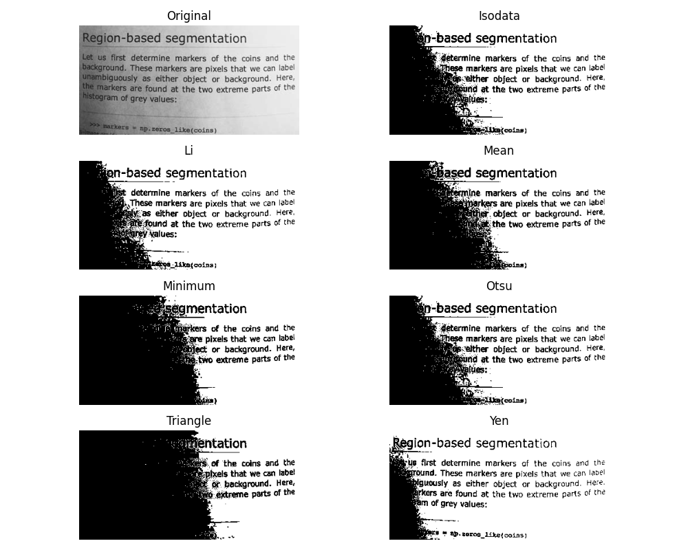

Thresholding
=====================

Example of thresholding functions.

.. currentmodule:: root_viewer.analysis.functions.thresholding
.. autosummary::
   :toctree: filtering
   :recursive:
   
   threshold_isodata
   threshold_li
   threshold_mean
   threshold_minimum
   threshold_otsu
   threshold_triangle
   threshold_yen